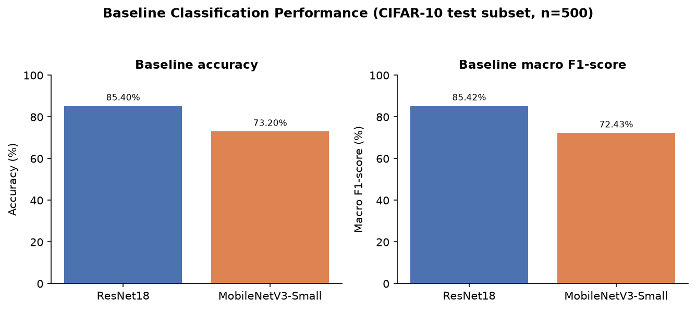
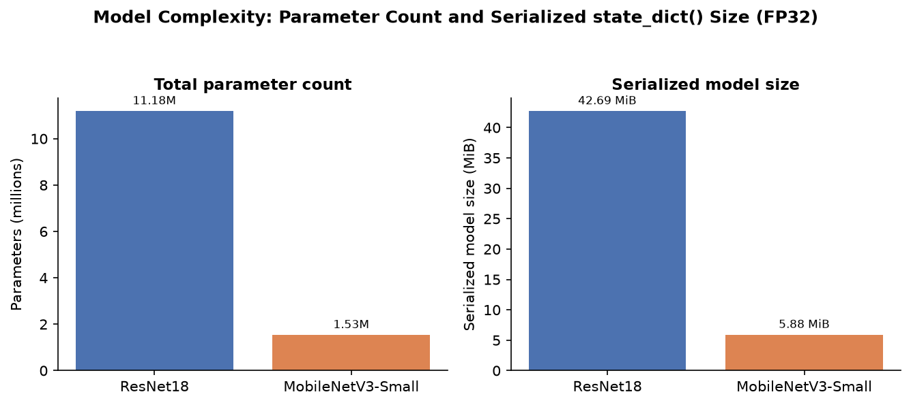
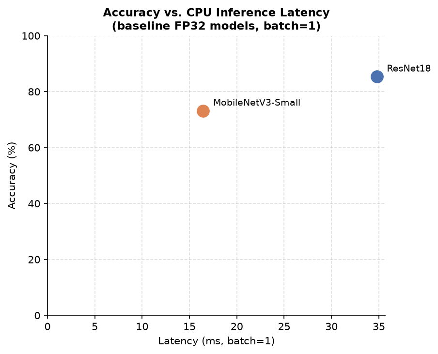
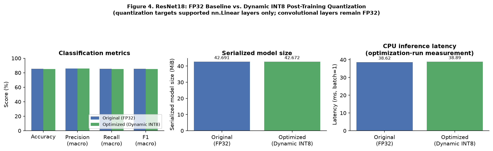
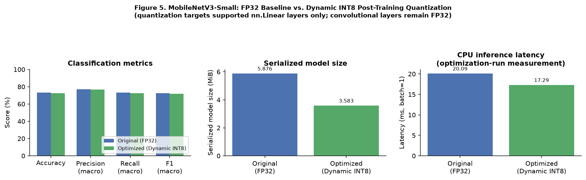
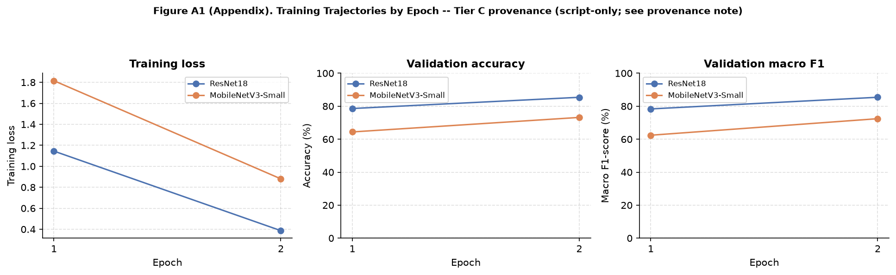

# Efficient Deep Learning for Computer Vision

## Accuracy–Efficiency Trade-offs in Image Classification

A Bachelor-level experimental research project studying the trade-off between predictive performance and computational efficiency in pretrained deep learning models for image classification.

## Research Question

> How can we improve the computational efficiency of a deep learning image-classification system while maintaining acceptable predictive performance?

This project is an experimental benchmark. It does not claim a new algorithm, a state-of-the-art result, or a novel quantization method.

## Models
The experiments compare two ImageNet-pretrained convolutional neural networks:

* **ResNet18** pretrained on ImageNet
* **MobileNetV3-Small** pretrained on ImageNet

The final classification heads are adapted to the 10 CIFAR-10 classes.

The models are evaluated under the same experimental configuration to study the relationship between predictive performance and computational efficiency.
## Dataset

The experiments use **CIFAR-10**, containing 60,000 color images across 10 classes.

The implementation:

* resizes images from `32 × 32` to `224 × 224`
* applies ImageNet normalization
* uses ImageNet-pretrained torchvision backbones
* uses fixed reproducible subsets selected with controlled random seeds

### Experimental Configuration

|Setting|Value|
|-|-:|
|Training images|2,000|
|Test images|500|
|Image resolution|224 × 224|
|Batch size|32|
|Epochs|2|
|Optimizer|AdamW|
|Learning rate|1e-4|
|Weight decay|1e-4|
|Random seed|42|
|Device|CPU|

The configuration is intentionally lightweight so that the experiment can be reproduced on a normal computer.

A fixed subset of 2,000 CIFAR-10 images is used for training and a separate fixed subset of 500 images is used for evaluation. No dedicated validation split is used in this lightweight experiment.

## Methodology

The experimental workflow consists of:

1. Load CIFAR-10 using reproducible subsets.
2. Resize the images to the input resolution expected by the pretrained models.
3. Apply ImageNet normalization.
4. Load ImageNet-pretrained ResNet18 and MobileNetV3-Small.
5. Adapt the final classification layers to the 10 CIFAR-10 classes.
6. Fine-tune both models using the same experimental configuration.
7. Evaluate predictive performance on the test subset.
8. Measure parameter count and estimated model size.
9. Benchmark CPU inference latency.
10. Compare predictive performance and computational efficiency.
11. Apply post-training dynamic INT8 quantization to supported `Linear` layers.
12. Compare the original and quantized models using the same optimization-run evaluation procedure.

## Evaluation Metrics

### Predictive Performance
The following classification metrics are reported:
* Accuracy
* Macro Precision
* Macro Recall
* Macro F1-score

### Computational Efficiency
The following efficiency-related metrics are reported:
* Total parameter count
* Estimated model size in MiB
* CPU inference latency in milliseconds

## Terminology 

The reported estimated model memory size is calculated from model parameters and buffers according to their data types. It is not the serialized .pt or .pth checkpoint file size.

Latency is hardware- and runtime-dependent. Direct latency comparisons are meaningful only when the same hardware, software environment, batch size, and measurement protocol are used.
# Results

The following results were obtained from the completed experiments using the default configuration described above.

## Baseline Comparison

|Model|Accuracy|Precision|Recall|Macro F1|Parameters|Estimated Model Memory (MiB)|Latency (ms)|
|-|-:|-:|-:|-:|-:|-:|-:|
|ResNet18|0.854|0.8595|0.8535|0.8542|11,181,642|42.69|34.78|
|MobileNetV3-Small|0.732|0.7709|0.7330|0.7243|1,528,106|5.88|16.44|

Under this experimental configuration, ResNet18 achieved higher measured predictive metrics, while MobileNetV3-Small required substantially fewer parameters, a smaller estimated model memory footprint, and lower measured baseline CPU inference latency.

Compared with ResNet18, MobileNetV3-Small had approximately:

* **86.3% fewer parameters**
* **86.2% smaller estimated model size**
* **52.7% lower measured baseline CPU latency**

ResNet18 achieved approximately:

* **12.2 percentage points higher accuracy**
* **12.2 percentage points higher macro F1**

These values describe this particular experimental configuration and should not be generalized as universal performance differences between the architectures.

### Visual Results
The repository contains two figure-generation workflows:

* src/generate_figures.py generates the original detailed experimental figures.
* paper/figures/generate_paper_figures.py generates the consolidated figures used for the research paper.

The research paper consolidates the original 12 experimental figures into five main figures and one appendix figure.

### Figure 1 — Baseline Predictive Performance

#### Accuracy and macro F1 comparison between ResNet18 and MobileNetV3-Small.



Under the tested configuration, ResNet18 achieved higher measured predictive performance, while MobileNetV3-Small offered a substantially smaller computational footprint.

### Figure 2 — Model Complexity and Memory Footprint

#### Parameter count and estimated model memory size.



MobileNetV3-Small used substantially fewer parameters and required considerably less estimated model memory than ResNet18.

### Figure 3 — Accuracy–Latency Trade-off

#### Measured CPU inference latency versus classification accuracy.



The figure illustrates the relationship between predictive accuracy and measured CPU inference latency for the two models under the reported experimental configuration.

### Figure 4 — ResNet18 Quantization

#### Effect of dynamic INT8 quantization on ResNet18.



The figure compares the original and dynamically quantized ResNet18 models in terms of predictive performance, estimated model memory size, and CPU inference latency.

### Figure 5 — MobileNetV3-Small Quantization

#### Effect of dynamic INT8 quantization on MobileNetV3-Small.



The figure compares the original and dynamically quantized MobileNetV3-Small models in terms of predictive performance, estimated model memory size, and CPU inference latency.

### Figure A1 — Training Curves

#### Training loss, evaluation accuracy, and evaluation macro F1 across the two epochs.



The appendix figure shows the evolution of the training loss and evaluation metrics during the two-epoch fine-tuning process.

## Epoch-wise Evaluation Results

The models were fine-tuned for two epochs.

The loss shown below is the training loss, while accuracy and macro F1 are evaluation metrics computed during the training process.

### ResNet18

|Epoch|Training Loss|Evaluation Accuracy|Macro F1|
|-:|-:|-:|-:|
|1|1.1446|0.7860|0.7836|
|2|0.3868|0.8540|0.8542|

### MobileNetV3-Small

|Epoch|Training Loss|Evaluation Accuracy|Macro F1|
|-:|-:|-:|-:|
|1|1.8152|0.6440|0.6240|
|2|0.8804|0.7320|0.7243|

## Post-Training Quantization

A second experiment investigated **dynamic INT8 post-training quantization**.

The optimization targets supported `Linear` layers only. The convolutional layers remain in floating-point precision.

Therefore, this experiment should be interpreted as a study of a simple post-training optimization rather than as full CNN quantization.

### ResNet18

|Metric|Original|Quantized|Change|
|-|-:|-:|-:|
|Accuracy|0.8540|0.8520|−0.20 pp|
|Precision|0.8595|0.8578|−0.17 pp|
|Recall|0.8535|0.8515|−0.21 pp|
|Macro F1|0.8542|0.8521|−0.21 pp|
|Estimated Model Memory (MiB)|42.69|42.67|−0.02 MiB|
|Latency (ms)|38.62|38.89|+0.27 ms|

For ResNet18, quantization of the supported linear layers produced only a very small reduction in estimated model size and did not improve measured latency in this experiment.

### MobileNetV3-Small

|Metric|Original|Quantized|Change|
|-|-:|-:|-:|
|Accuracy|0.7320|0.7240|−0.80 pp|
|Precision|0.7709|0.7667|−0.41 pp|
|Recall|0.7330|0.7255|−0.75 pp|
|Macro F1|0.7243|0.7166|−0.78 pp|
|Estimated Model Memory (MiB)|5.88|3.58|−2.29 MiB|
|Latency (ms)|20.09|17.29|−2.80 ms|

For MobileNetV3-Small, the quantization experiment reduced the measured model size by approximately **39.0%** and reduced measured latency by approximately **13.9%**, while predictive metrics decreased modestly under this configuration.

> The original and quantized latency values above are compared within the same optimization run. They should not be directly compared with the separate baseline benchmark latency values because runtime measurements can vary between benchmark runs.

## Accuracy–Efficiency Trade-off

The experiments illustrate that model selection involves more than predictive accuracy alone.

Under the tested configuration:

* ResNet18 provided higher measured predictive performance.
* MobileNetV3-Small used substantially fewer parameters.
* MobileNetV3-Small had a substantially smaller estimated model footprint.
* MobileNetV3-Small had lower measured baseline CPU latency.
* The simple dynamic quantization experiment had different effects on the two architectures.

The purpose is not to identify a universally superior architecture, but to experimentally examine the relationship between:

* predictive accuracy
* model size
* parameter count
* inference latency
* post-training optimization

The results therefore describe an experimental trade-off rather than a universal ranking of the two architectures.


## Project Structure

efficient-deep-learning-cv/
│
├── README.md
├── requirements.txt
├── .gitignore
│
├── src/
│   ├── data.py
│   ├── models.py
│   ├── train.py
│   ├── evaluate.py
│   ├── benchmark.py
│   ├── optimize.py
│   └── generate_figures.py
│
├── results/
│   ├── training/
│   │   ├── resnet18.csv
│   │   └── mobilenetv3_small.csv
│   │
│   ├── evaluation/
│   │   ├── resnet18.json
│   │   └── mobilenetv3_small.json
│   │
│   ├── optimization/
│   │   ├── resnet18.json
│   │   └── mobilenetv3_small.json
│   │
│   ├── benchmark.csv
│   └── figures/
│
├── report/
│   └── report.md
│
└── paper/
    ├── data/
    │   └── experiment_results.json
    │
    ├── figures/
    │   ├── generate_paper_figures.py
    │   ├── fig1_baseline_accuracy_f1.png
    │   ├── fig2_parameters_and_size.png
    │   ├── fig3_accuracy_vs_latency.png
    │   ├── fig4_resnet18_quantization.png
    │   ├── fig5_mobilenetv3_small_quantization.png
    │   └── figA1_training_curves.png
    │
    └── research_paper.md


### Main Modules

* `src/data.py` — dataset loading, preprocessing, reproducible subsets, and random seed configuration.
* `src/models.py` — model construction and model-size utilities.
* `src/train.py` — model fine-tuning and checkpoint generation.
* `src/evaluate.py` — checkpoint evaluation and classification metrics.
* `src/benchmark.py` — inference benchmarking and model comparison.
* `src/optimize.py` — post-training dynamic quantization experiment.
* `src/generate_figures.py` — Generates the original detailed experimental figures from the project results.
* `paper/figures/generate_paper_figures.py` — Generates the consolidated figures used in the research paper from the centralized experiment results.

Generated datasets, checkpoints, virtual environments, CSV/JSON result files, and temporary files are excluded from version control through `.gitignore`.
## Repository Scope
This repository contains the source code, experimental results, analysis scripts, and research-paper materials associated with the project.

The `src/` directory contains the experimental pipeline.

The `results/` directory contains the generated experimental outputs.

The `paper/` directory contains the research-paper manuscript materials, centralized paper data, and consolidated publication figures.

The project therefore separates the experimental implementation from the presentation and analysis used in the research paper.
## Installation

From the project root:

```bash
python -m venv .venv
```

### Windows PowerShell

```powershell
.venv\\Scripts\\Activate.ps1
```

If PowerShell blocks script execution for the current session:

```powershell
Set-ExecutionPolicy -Scope Process -ExecutionPolicy RemoteSigned
```

Then activate the environment:

```powershell
.venv\\Scripts\\Activate.ps1
```

### Linux/macOS

```bash
source .venv/bin/activate
```

Install dependencies:

```bash
python -m pip install --upgrade pip
pip install -r requirements.txt
```

## Reproduction

All commands should be executed from the project root.

### Train ResNet18

```bash
python -m src.train --model resnet18
```

### Train MobileNetV3-Small

```bash
python -m src.train --model mobilenetv3-small
```

The first run downloads the CIFAR-10 dataset and the required ImageNet pretrained weights.

### Evaluate ResNet18

```bash
python -m src.evaluate --model resnet18 --checkpoint results/checkpoints/resnet18\_best.pt
```

### Evaluate MobileNetV3-Small

```bash
python -m src.evaluate --model mobilenetv3-small --checkpoint results/checkpoints/mobilenetv3\_small\_best.pt
```

### Benchmark Both Models

```bash
python -m src.benchmark --resnet-checkpoint results/checkpoints/resnet18\_best.pt --mobilenet-checkpoint results/checkpoints/mobilenetv3\_small\_best.pt
```

### Run the Optimization Experiment

For ResNet18:

```bash
python -m src.optimize --model resnet18 --checkpoint results/checkpoints/resnet18\_best.pt
```

For MobileNetV3-Small:

```bash
python -m src.optimize --model mobilenetv3-small --checkpoint results/checkpoints/mobilenetv3\_small\_best.pt
```

## Reproducibility

The project uses a fixed random seed of `42` to improve reproducibility of dataset selection and training-related randomness.

However, exact numerical results may vary depending on:

* CPU/GPU hardware
* PyTorch version
* torchvision version
* operating system
* numerical libraries
* number of threads
* runtime configuration

Therefore, reproducibility should be understood as **controlled experimental reproducibility**, not a guarantee of bit-identical results on every machine.

## Limitations

### Dataset

CIFAR-10 is a relatively small benchmark and does not represent every real-world computer-vision task.

The original images are only `32 × 32` pixels. Resizing them to `224 × 224` is an experimental preprocessing choice required to use the selected ImageNet-pretrained architectures consistently.

### Training Scale

The default experiment uses only 2,000 training images, 500 test images, and two training epochs.

This makes the experiment feasible on modest hardware but means that the results should be interpreted as a lightweight experimental study rather than a definitive benchmark.
### No Dedicated Validation Set
The experiment does not use a separate validation split.

The 500-image subset is used for evaluation during the reported experiment.

Therefore, the study should not be interpreted as a full train/validation/test experimental protocol.
### Hardware

Inference latency depends on hardware, software, batch size, thread configuration, and measurement protocol.

Latency values should therefore not be generalized beyond the experimental environment.

### Quantization
Only supported Linear layers are dynamically quantized.

The convolutional backbone remains in floating-point precision.

Consequently, the observed memory and latency changes do not represent the potential effect of full convolutional INT8 quantization.

### Statistical Variability
The reported experiment uses one random seed.

Repeated experiments with multiple seeds would provide stronger statistical evidence and could support confidence intervals or other measures of variability.
## Training Duration
The models are trained for only two epochs.

The resulting performance should therefore be interpreted as the outcome of a lightweight experimental configuration rather than as fully optimized model performance.
## Future Work

Possible extensions include:

* larger CIFAR-10 subsets
* longer training schedules
* multiple random seeds
* confidence intervals
* controlled CPU/GPU comparisons
* more rigorous latency measurement
* additional computer-vision datasets
* additional lightweight architectures
* convolution-aware quantization
* pruning
* knowledge distillation
* additional model-compression techniques
* deployment-oriented benchmarking on edge or resource-constrained hardware
These extensions could provide stronger evidence about the generality of the observed accuracy–efficiency trade-offs.
## Academic Positioning

This project is an **experimental Bachelor-level research project**.

It is intentionally presented as:

* a reproducible experimental comparison
* an analysis of accuracy–efficiency trade-offs
* an introduction to efficient deep learning experimentation
* a practical study of model optimization

It does not claim to be:

* a novel deep learning algorithm
* a state-of-the-art contribution
* a new quantization method
* a production-ready deployment system

The project emphasizes reproducibility, controlled experimentation, meaningful evaluation metrics, computational efficiency, and honest interpretation of experimental evidence.

## Research Scope

The project lies at the intersection of:

* Artificial Intelligence
* Machine Learning
* Deep Learning
* Computer Vision
* Efficient AI
* Model Optimization
* AI Systems and Infrastructure

The experimental design is intentionally small enough to be completed at Bachelor level while introducing concepts relevant to research in efficient machine learning and resource-aware AI systems.

## Conclusion

This project experimentally investigates how predictive performance and computational efficiency interact when comparing pretrained deep learning models for image classification.

Under the tested CIFAR-10 configuration, ResNet18 achieved higher predictive metrics, while MobileNetV3-Small demonstrated a substantially smaller computational footprint and lower measured baseline CPU latency.

The quantization experiment further illustrates that the impact of an optimization technique depends on both the architecture and the part of the model being optimized.

The results are specific to the experimental configuration and should not be interpreted as universal rankings of the two architectures.

The project provides a reproducible Bachelor-level framework for further investigation into efficient deep learning, model optimization, and resource-aware AI systems.